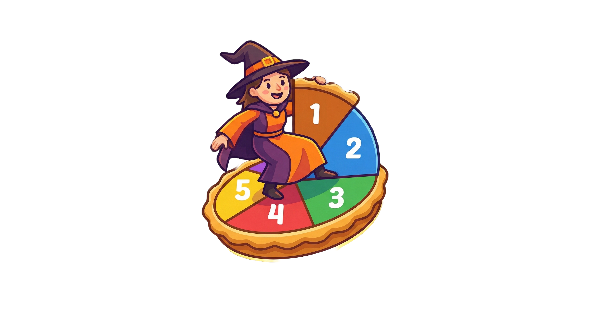
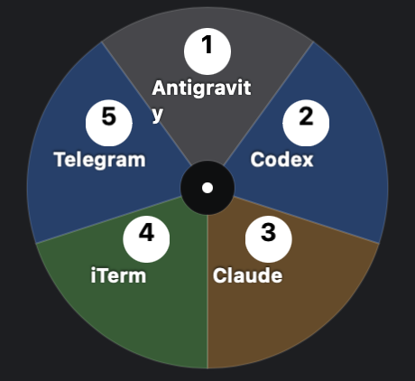

<p align="center">
  
</p>

# PiSwitch

(/pɪs.wɪtʃ/)

A radial pie-menu app switcher for **macOS** and **Windows**. Supports multiple instance menus (e.g. `default`, `messaging`, `finder-groups`). Trigger it with a hotkey, flick toward the app you want and release — or press the number on the slice to switch instantly.

<p align="center">
  
</p>

---

## macOS

### Build

```bash
cd /path/to/piswitch
./scripts/build.sh
```

Requires Xcode command-line tools (`xcode-select --install`).

### Setup

Initialize local configs from the bundled examples:

```bash
./scripts/init-config.sh
```

Then customize the instance files:

- `config/instances/default.json` — your main app switcher
- `config/instances/messaging.json` — chat/communication apps
- `config/instances/finder-groups.json` — Finder group shortcuts

### Usage

```bash
# Default instance
./scripts/piswitch-launcher.sh

# Named instance
./scripts/piswitch-launcher.sh messaging
./scripts/piswitch-launcher.sh finder-groups
```

### Hotkey setup with Karabiner-Elements

Example rules in `examples/karabiner/hyper-piswitch-rule.json`:

| Hotkey | Action |
|---|---|
| Caps Lock | Remapped to Hyper (`Cmd+Ctrl+Opt+Shift`) |
| Hyper + R | PiSwitch default |
| Hyper + H | PiSwitch messaging |
| Hyper + G | PiSwitch finder-groups |

To use: copy the rule into your Karabiner config and replace `REPLACE_WITH_ABSOLUTE_PATH` with your local project path.

### Finder groups

For the `finder-groups` instance, app names like `home`, `work`, `projects` resolve to stub `.app` bundles at:

1. `assets/finder-groups/<name>.app`
2. Fallback: `../bin/finder-groups/<name>.app`

These open specific Finder locations rather than real applications.

---

## Windows

### Build

Requires [.NET 8 SDK](https://dotnet.microsoft.com/download/dotnet/8.0).

```powershell
cd \path\to\piswitch
.\scripts\build-windows.ps1
```

This produces a self-contained single-file executable at `dist\bin-windows\PiSwitch.exe`.

### Setup

Run the setup script to install, configure auto-start, and launch:

```powershell
.\scripts\setup-windows.ps1

# Or from any directory (note the & operator for paths with spaces):
& "C:\path\to\piswitch\scripts\setup-windows.ps1"
```

This will:

1. Copy example configs to `config\instances\` (won't overwrite existing ones)
2. Install `PiSwitch.exe` to `%LOCALAPPDATA%\PiSwitch\`
3. Create a startup shortcut so PiSwitch launches on login
4. Set the `PISWITCH_HOME` environment variable pointing to the repo
5. Start PiSwitch in the background

The Windows initializer also migrates an existing default menu so `T3 Code` is
slot 1 and removes the old `Antigravity` slot. Setup writes
`%LOCALAPPDATA%\PiSwitch\piswitch-home.txt` and refreshes a local fallback copy
of the configs. When the configured checkout exists, the installed daemon and
AutoHotkey resolve that same project home. When it is temporarily unavailable,
the installed daemon uses the synchronized local config instead of creating an
empty checkout tree. Startup launches use `--start-only`, so two auto-start paths
cannot pop the menu merely because one daemon already won the mutex.

After setup, PiSwitch runs as a background daemon with a system tray icon.

### Hotkey setup with AutoHotkey

PiSwitch is triggered via a named Windows event — no polling, no temp files, instant response. An example [AutoHotkey](https://www.autohotkey.com/) script is provided at `examples\autohotkey\hyper-piswitch.ahk`.

To add the trigger to an existing AutoHotkey script (v1 syntax):

```ahk
#r::
  hEvent := DllCall("OpenEvent", "UInt", 0x0002, "Int", 0, "Str", "Local\PiSwitch_show_default", "Ptr")
  if (hEvent) {
    DllCall("SetEvent", "Ptr", hEvent)
    DllCall("CloseHandle", "Ptr", hEvent)
  }
return
```

AutoHotkey v2 syntax:

```ahk
#r:: {
    static EVENT_MODIFY_STATE := 0x0002
    hEvent := DllCall("OpenEvent", "UInt", EVENT_MODIFY_STATE, "Int", 0, "Str", "Local\PiSwitch_show_default", "Ptr")
    if (hEvent) {
        DllCall("SetEvent", "Ptr", hEvent)
        DllCall("CloseHandle", "Ptr", hEvent)
    }
}
```

The existing personal AutoHotkey v1 controller can keep its other device
shortcuts in its sync folder. Its PiSwitch trigger should resolve
`PISWITCH_HOME` (falling back to `piswitch-home.txt`) and then signal the named
event; it does not need a Google Drive path or a second PiSwitch config. If that
controller runs elevated and must cold-start PiSwitch, launch PiSwitch through
Explorer (for example with `ShellRun`) and pass `--start-only`; a direct child
launch would make PiSwitch and any newly started target app inherit elevation.

Run the focused Windows checks with:

```powershell
.\scripts\test-windows.ps1
```

The event name format is `Local\PiSwitch_show_<instance>` — replace `default` with your instance name for multiple menus.

### System tray

Right-click the PiSwitch tray icon for:

- **Show Menu** — open the pie menu at the cursor
- **Reload Config** — re-read the config file without restarting
- **Exit** — shut down PiSwitch

### Re-triggering without AutoHotkey

Running `PiSwitch.exe` again while the daemon is already running will signal the existing instance to show the menu (it won't spawn a duplicate).

---

## Config format

The same JSON config format works on both macOS and Windows.

Minimal config — just list the apps:

```json
{
  "apps": ["Chrome", "Visual Studio Code", "Windows Terminal", "Slack", "Spotify"]
}
```

With optional overrides for colors, labels, and executable paths:

```json
{
  "apps": ["Chrome", "Visual Studio Code", "Windows Terminal", "Slack", "Spotify"],
  "colors": {
    "Chrome": "#FFCC00",
    "Visual Studio Code": "systemBlue",
    "Windows Terminal": "#2D2D2D"
  },
  "labels": {
    "Visual Studio Code": "VS Code",
    "Windows Terminal": "Terminal"
  },
  "paths": {
    "MyApp": "C:\\Program Files\\MyApp\\myapp.exe"
  }
}
```

**Apps** — names of applications to include in the pie menu (2–8 apps). Many popular apps have built-in colors and short labels.

**Colors** — hex (`#RGB`, `#RRGGBB`, `#RRGGBBAA`) or named colors (`systemBlue`, `systemGreen`, `red`, `teal`, etc.).

**Labels** — override the display text on each pie slice.

**Paths** (Windows) — explicit executable paths for apps that can't be found automatically. PiSwitch searches Start Menu shortcuts by default, so most apps don't need this.

### App switching behavior (Windows)

When you select an app from the pie menu:

1. If the app is already running, PiSwitch activates its existing window (including tray-only apps)
2. If not running, PiSwitch launches it via Start Menu shortcut or the configured path

## Project layout

```
Sources/PiSwitch/main.swift        macOS app (single-file Swift)
windows/PiSwitch/                  Windows app (C#/WPF, .NET 8)
scripts/
  build.sh                         macOS build
  build-windows.ps1                Windows build (dotnet publish)
  setup-windows.ps1                Windows install + auto-start
  init-config.sh                   macOS config init
  init-config-windows.ps1          Windows config init
  piswitch-launcher.sh             macOS launcher
  smoke-test.sh                    macOS sanity check
config/
  examples/                        Public example configs
    default.json                   macOS default
    default-windows.json           Windows default
    messaging.json                 Chat/communication apps
  instances/                       Local configs (gitignored)
examples/
  karabiner/                       macOS Karabiner-Elements snippets
  autohotkey/                      Windows AutoHotkey scripts
assets/
  logo/                            Project logo
  screenshots/                     Screenshots
  finder-groups/                   macOS Finder group stubs
dist/
  bin-windows/                     Windows build output (gitignored)
```

## License

MIT. See `LICENSE`.
